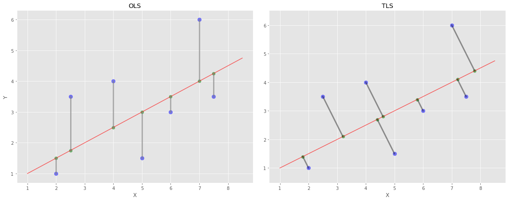

# Ordinary Least Squares and Total Least Squares projection concept image
 
This shows how these two methods project data points onto the regression line.
OLS projects a dependent variable on the line s.t. the residula between itself and a fitted value is parallel to axis of dependent variables. On the other hand, that of TLS is just orthogonal toward the regression line since it accounts for observational errors in dependent values as well.

Please have a look at TLS implementation with Python (https://github.com/RyotaBannai/total-least-squares)
Also the original article using this concept image is avialable for further explanation and experiments.(https://towardsdatascience.com/total-least-squares-in-comparison-with-ols-and-odr-f050ffc1a86a) 